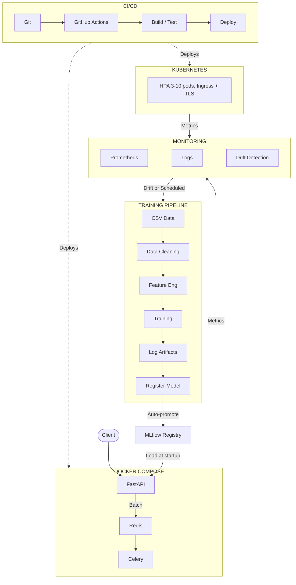

# Loan Default Prediction System — Design Document

## Problem Statement

Financial institutions need real-time loan default risk assessment to make informed lending decisions. The system must predict default probability within 50ms, support batch processing for portfolio analysis (1,000+ loans), maintain >99% uptime, and detect model degradation automatically.

**Constraints:** Small dataset (10k rows) favoring tree-based models | Small ML team (2-3 people) prioritizing simplicity | Budget-conscious, open-source first | Cloud-agnostic, no vendor lock-in

| Metric | Target | Achieved |
|--------|--------|----------|
| API latency (p99) | < 100ms | 25ms |
| Model recall | ≥ 75% | 77% |
| Model accuracy | ≥ 88% | 89% |
| ROC-AUC | ≥ 0.85 | 0.87 |

---

## Architecture

**Data Flow:**
- **Training:** CSV → Cleaning → Feature Engineering (Saving_Rate) → SMOTE → XGBoost → Log to MLflow → Auto-promote if criteria pass
- **Real-time:** Client → FastAPI → Feature Eng → Prediction → Response (15-25ms)
- **Batch:** Client → FastAPI → Redis → Celery Worker → Results
- **Monitoring:** 10% of predictions sampled → PSI drift detection → Retraining trigger if PSI > 0.15

**Deployment:** Docker Compose for dev (4 containers: API, Celery, Redis, MLflow). Kubernetes for production (HPA, TLS Ingress, PVC storage). Same Docker images in both — build once, deploy anywhere.

---

## Technology Choices

| Component | Technology | Why Over Alternatives |
|-----------|-----------|----------------------|
| **API** | FastAPI + Uvicorn | Async, auto OpenAPI docs, Pydantic validation. 3x faster than Flask |
| **Model** | XGBoost | Best for small tabular data. 10ms inference vs 100ms+ for NNs. No GPU |
| **Registry** | MLflow | Industry standard versioning. Migrates to Databricks/SageMaker |
| **Batch** | Celery + Redis | Redis doubles as broker and result backend — one fewer service |
| **Monitoring** | Prometheus + Loguru | Custom ML metrics with structured JSON logging |

---

## Key Decisions & Trade-offs

| Decision | Choice | Trade-off |
|----------|--------|-----------|
| **Stateless API** | Model cached in memory at startup | Restart required for updates. Mitigated by K8s rolling updates |
| **PSI Drift** | PSI with 0.15 threshold, 10% sampling | Detects distribution shift only, not concept drift |
| **Local MLflow** | SQLite + filesystem | No multi-user sync. Sufficient for single-team use case |
| **API Key Auth** | Header-based `X-API-Key` | No fine-grained permissions. Adequate for internal API |

**What We Didn't Build:**

| Feature | Why Not | When To Add |
|---------|---------|-------------|
| **A/B Testing** | Single model, nothing to compare | Model v2 |
| **Feature Store** | Only 4 features, overhead not justified | 20+ features or cross-team sharing |
| **SHAP Explainability** | +50-100ms latency, not regulated | Offline compute for audits |
| **Multi-Region** | Single-region traffic | Global user base |

---

## Production Operations

**Monitoring:** Three layers — infrastructure (Prometheus: latency, error rate, prediction count), model quality (PSI drift detection with alerting), business (predictions/hour, batch success rate, model version consistency).

| PSI Range | Action | Timeline |
|-----------|--------|----------|
| 0.10 – 0.15 | Log warning, monitor | Ongoing |
| 0.15 – 0.25 | Alert on-call, investigate | 1-2 hours |
| > 0.25 | Retrain or rollback | 4-8 hours |

**Rollback:** Change `MODEL_STAGE` env var → restart. Zero downtime on K8s via rolling updates. **Resilience:** Failed model load → `/readyz` returns 503 (no traffic), `/healthz` returns 200 (stays alive). Rate limit: 100 req/min per IP. **Testing:** Unit (72% coverage) + integration + e2e. CI enforces 70%+ gate.

---

## Scaling Strategy

| Phase | Throughput | Approach |
|-------|-----------|----------|
| **Current** | 400 req/sec | Docker Compose, 4 Uvicorn workers |
| **Phase 1** | 1,200 – 3,000 | K8s HPA (3-10 pods), Redis caching |
| **Phase 2** | 3,000 – 6,000 | 20 pods, Redis Cluster, Cluster Autoscaler |
| **Phase 3** | 10,000+ | Multi-region, global load balancer |

**Bottlenecks:** Model loading (30s — pre-warm with init containers), single Redis (→ Cluster), local MLflow (→ S3 + PostgreSQL). For multiple models: separate K8s deployments per model with Ingress routing.

---

## Assumptions

- **Data:** Static 10k rows, updated weekly/monthly. Ground truth with 30-day lag
- **Traffic:** 100-500 req/sec baseline, 2x peak at month-end. Single region
- **Team:** 2-3 data scientists + 1-2 ML engineers. Familiar with Python, Docker, K8s
- **Security:** Internal API, no PII in requests, API key auth sufficient
- **Budget:** < $5,000/month infrastructure

---

## Limitations & Roadmap

**Limitations:** No hot-reloading | PSI misses concept drift | Local MLflow no sync | Single Redis | Manual rollback | Batch capped at 1,000

**Roadmap:** CI/CD pipeline (GitHub Actions) → SHAP explainability (offline) → Cloud MLflow (S3 + RDS) → Automated drift retraining → Shadow mode A/B testing → Multi-model serving (Helm)

---

*Every decision optimized for simplicity now with a clear path to scale later. What isn't built is documented with reasoning for when to add it.*
